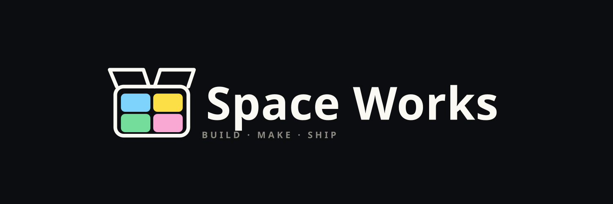

<div align="center">

  

  <h1>Space Works — Open Source Makerspace Manager</h1>

<p>
  Self-hostable, multi-tenant <strong>management platform for makerspaces</strong> — run your
  inventory, tool &amp; equipment lending, and 3D printing in one place. Browse, borrow, track, and
  stay accountable, without spreadsheets.
</p>

<p>
  <a href="LICENSE"></a>
  <a href="https://github.com/SpaceWorks-HQ/SpaceWorks/actions/workflows/release.yml"></a>
  
  <a href=".github/CONTRIBUTING.md"></a>
</p>

</div>

---

Space Works started inside the **TinkerSpace Kochi** community, from a simple need: make it easy for a
makerspace to know **what tools and equipment exist, who borrowed what, what's available, and how
every loan and print job moves from request to done** — with enough traceability that accountability
for shared gear is never a guessing game. It's built by makers, for makers: run it at your space, fork it, remix it, or use it as
a starting point. If your community works differently, make it your own.

One deployment can host **many makerspaces** (tenants). Each owns its inventory, public URL, staff,
Telegram group, QR namespace, and audit scope — fully isolated from the others.

## Features

- **Public catalog** — browse by makerspace and category, request to borrow, and (when enabled)
  **QR self-checkout/return** for present members with photo evidence.
- **Full hardware lifecycle** — request → accept → issue (box QR scan + photo) → return (photo +
  remark) → accountability, all audited. Direct staff handouts too.
- **3D-printing manager** — public print requests, printer/spool management, filament tracking,
  slicer estimates, and an optional (staff-private) cash charge at collection.
- **QR everywhere** — boxes, tools, and individual assets; immutable scan history.
- **Action-based staff console** — editable per-makerspace roles over a fixed action set, five seeded
  defaults, and a superadmin-only Django control plane.
- **Reports & ledger** — what's out, who has it, overdue tracking, CSV/XLSX export.
- **Notifications** — per-makerspace Telegram alerts and async (Celery) email.
- **Traceable by design** — append-only audit log; immutable evidence photos and scan records.

## Quick start

Space Works runs entirely through Docker Compose — it brings up **PostgreSQL, Redis, MinIO storage, the
Celery worker/beat, and database migrations** and wires them to the app for you (the images don't bake
in any addresses; the compose file passes them in). Pick one path:

**Path 1 — Guided setup (easiest; builds from source).** One script generates all secrets, writes
`.env`, builds everything, and creates your first admin + makerspace:

```bash
git clone https://github.com/SpaceWorks-HQ/SpaceWorks.git
cd SpaceWorks
bash setup.sh                                          # macOS / Linux
powershell -ExecutionPolicy Bypass -File setup.ps1     # Windows
```

It prints your URL and login when it finishes and offers to install seven-day, backup-first production update checks. Super Admins can control
automatic or manual installation from **Platform settings -> Software updates**. (Requires [Docker Desktop](https://www.docker.com/products/docker-desktop/).)

**Path 2 — Prebuilt images (no local build).** Pull the two published images and start the stack —
after `cp .env.example .env` (fill in the few values it asks for):

```bash
export MAKERSPACE_IMAGE_TAG=latest        # or pin a release, e.g. 0.5.1-main.42.a1b2c3d4e5f6
docker compose -f docker-compose.prod.yml up -d
```

This pulls **`ghcr.io/spaceworks-hq/spaceworks-backend`** + **`ghcr.io/spaceworks-hq/spaceworks-frontend`** and brings up the
full stack automatically.

## Documentation

| I want… | Go to |
|---|---|
| A **plain-language, non-technical** walkthrough | **[docs/setup-for-makerspaces.md](docs/setup-for-makerspaces.md)** |
| **Production** reference (env vars, TLS, upgrades, releases) | **[docs/self-hosting.md](docs/self-hosting.md)** |
| **Advanced** config (Telegram, HMAC, Supabase, cron) | **[.github/ADVANCED.md](.github/ADVANCED.md)** |
| **Develop / contribute** (run from source, tests, releases) | **[.github/DEVELOPMENT.md](.github/DEVELOPMENT.md)** |

## Roadmap

Space Works 0.5 is focused on reliable self-hosting and complete makerspace operations:

- automatic, backup-first updates from every successful `main` release;
- stable public, member, staff, and superadmin workflows across the full module set;
- continued accessibility, mobile, reporting, and operational resilience work.

Current work and shipped changes are tracked in
[GitHub issues](https://github.com/SpaceWorks-HQ/SpaceWorks/issues),
[pull requests](https://github.com/SpaceWorks-HQ/SpaceWorks/pulls), and the release notes. The running
product intentionally does not expose a separate roadmap page.

## Roles & access

Access is scoped **per makerspace and per action**. Super Admin is global; every other role is a
per-makerspace membership.

Authority comes from **actions, not role names**. A role is a row owned by one makerspace holding a
list of granted action strings (`view_inventory`, `accept_request`, `issue_direct_loan`,
`manage_machines`, …), and every permission check asks whether the actor holds the action — never
what their role is called. So a makerspace can rename, re-scope, or invent roles to match how it
actually works, and nothing downstream has to learn the new name.

Every makerspace starts with five protected default roles:

| Role | Granted actions | Notes |
|---|---|---|
| **Space Manager** | Everything grantable: full hardware lifecycle, inventory, QR, evidence, machines, events, bookings, audit, and makerspace settings | Must always keep `manage_makerspace` |
| **Inventory Manager** | Full hardware lifecycle + inventory + QR + evidence + audit | No machines, staff or settings |
| **Machine Manager** | `manage_machines` — assigned machines end-to-end, including usage, warranty and maintenance | Implies `manage_printing`, so it absorbed the old Print Manager |
| **Guest Admin** | Handout-only: issue accepted requests, create direct handouts, process returns, upload evidence | Capped at the handout set; cannot be widened |
| **Member** | None | A role granting no actions *is* a community membership — that is how staff and member invitations are told apart |

Beyond those, a Space Manager can **create custom roles** with any subset of actions they themselves
hold, and can edit the defaults — including renaming them and narrowing what they grant. Two limits
protect the defaults from being edited into incoherence: Space Manager must retain
`manage_makerspace`, and Guest Admin must stay within the handout actions. Protected defaults cannot
be deleted; custom roles can be, once nobody is assigned to them.

Escalation is blocked in both directions: you cannot grant an action you do not hold, you cannot
create or assign a role carrying `manage_makerspace` (superadmin only), and you cannot modify a
membership that already holds it. `transfer_stock` and `manage_staff` are superadmin-only and are
never grantable to any role.

Outside this system entirely: **Public** users browse, submit requests, and — where enabled —
self-checkout and return eligible QR tools, gated on member presence and photo evidence.

> Earlier versions shipped five fixed, code-defined roles. Roles are now editable data; the five
> above are seeded defaults rather than the whole vocabulary.

Staff work in the **React console** at `/admin`; the superadmin-only **Django control plane** lives at
`/control/` (backend-only, never exposed on the public port). Two design rules are load-bearing — the
Request Workflow module is the single source of truth for state transitions, and the Inventory
Availability module owns all quantity math. Details in **[.github/CONTRIBUTING.md](.github/CONTRIBUTING.md)**.

## Hosting

**The goal is to self-host inside the makerspace, on your own server** — your data, your network, no
third party. The [Quick start](#quick-start) above is the recommended path. After it's up:

| Surface | URL |
|---|---|
| Public catalog | `http://localhost` |
| Staff console | `http://localhost/admin` |
| API | `http://localhost/api` (Swagger at `/docs/`) |
| Django control plane | `/control/` on the backend only — **not** exposed on the public port |

Create the first superadmin + makerspace (the wizard does this for you; for a manual instance):

```bash
docker compose -f docker-compose.prod.yml exec backend python manage.py setup_instance
```

With no arguments it seeds **`superadmin` / `super123`** and forces a password change on first login.
Guided installs can receive each successful `main` release automatically with a backup and readiness
check. If deployment fails, the application containers return to the previous retained release. Run
`scripts/update.sh --force` (macOS/Linux) or `scripts/update.ps1 -Force` (Windows) for an immediate
update; see **[docs/self-hosting.md](docs/self-hosting.md)** for scheduling, pinning, TLS, and recovery.

**No server of your own?** Space Works is multi-tenant — partner with a nearby makerspace to run your space
as a tenant on their instance. **Prefer managed Postgres?** Point `DATABASE_URL` at any managed
Postgres (e.g. Supabase) and host the app anywhere; a fully-managed free-tier path is documented in
**[docs/supabase-deployment.md](docs/supabase-deployment.md)** (best for demo/pilot, not dependable
production).

## Tech stack

Django 6 + DRF · React 19 + Vite 8 + Tailwind CSS 4 + TypeScript (TanStack Query v5) · PostgreSQL 16 ·
Celery + Redis · MinIO (S3-compatible) · django-unfold admin · drf-spectacular / OpenAPI. Delivered as
two Docker images (`spaceworks-backend`, `spaceworks-frontend`); everything else is official upstream images.

## Contributing

Space Works is a collaborative project for the makerspace community, and **contributors are very welcome** —
code, docs, translations, or just running it at your space and reporting what's rough. See
**[.github/CONTRIBUTING.md](.github/CONTRIBUTING.md)**. **No CLA is required** — by opening a pull
request you agree your contribution is offered under the project's AGPL-3.0-or-later license
(inbound = outbound); merged contributors are credited in
[.github/CONTRIBUTORS.md](.github/CONTRIBUTORS.md).

## License

Space Works is **free and open source software**, licensed under the
**[GNU Affero General Public License v3](LICENSE)** (`AGPL-3.0-or-later`).

You are free to use, study, share, and modify Space Works — for **any** purpose, commercial or
noncommercial — subject to the AGPL. Because the AGPL is a **network copyleft** license: if you run
a modified version and let users interact with it over a network, you must offer those users the
corresponding source code of your modified version under the same license.

## Contributors

Thanks to **everyone** who has contributed to Space Works — code, docs, bug reports, or running it at their
space. The wall below is pulled live from this repository's
[GitHub contributor graph](https://github.com/SpaceWorks-HQ/SpaceWorks/graphs/contributors) and
shows **all** contributors — bots and automation included, no filtering:

[](https://github.com/SpaceWorks-HQ/SpaceWorks/graphs/contributors)

<sub>Contributor image by [contrib.rocks](https://contrib.rocks).</sub>
